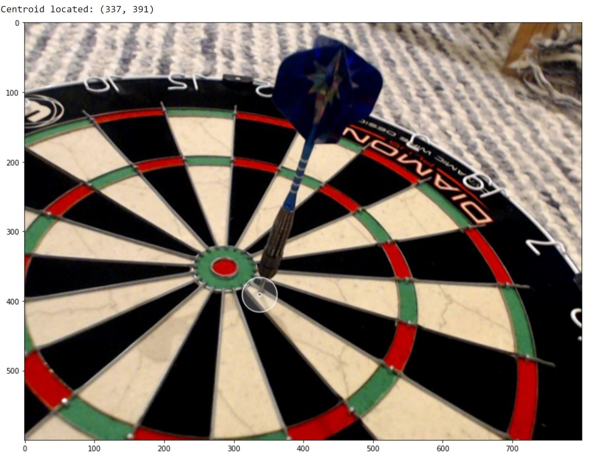
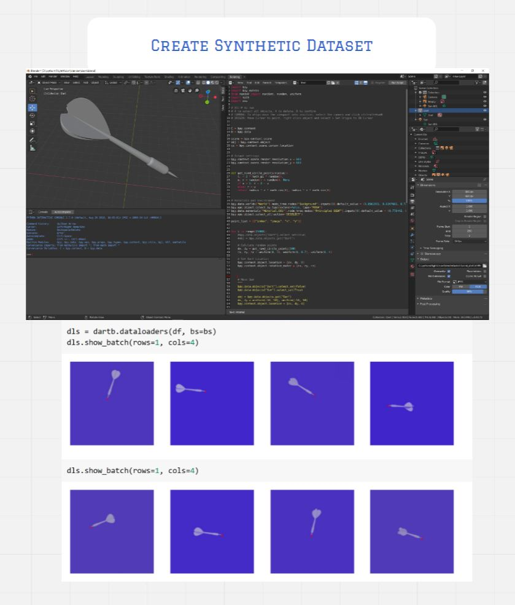

# FlightVision
> Precision dart coordinates for serious bar sports.

A `Unet` fastai alternate solution to track `(x,z)` coordinates via segmentations layers, rather than classical regression. 

  

  

  

  

 

# Creating a Synthetic Dataset in Blender
The real dataset I built (300 pictures of me awkwardly holding up a dart) simply wasn't training. I new something must be wrong with my training pipelines - beacuse conceptually the CNN only needs to identify a couply of lines and the dart tip (!) so I was deeply suspicious and confused when the regression model wouldn't converge on anything near the correct coordinates.  

Using blender, I aimed to completely simplify the vision problem by using a generated dataset.  

